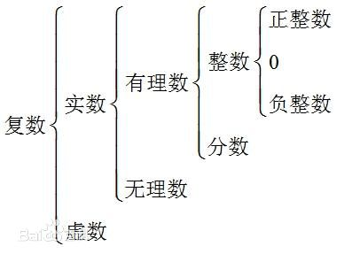
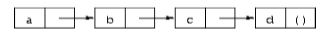

本章的目的是向Scheme新手介绍这门语言，强烈建议阅读本章的读者自己将所有代码例子运行一遍。
阅读完本章并完成习题后，你将学会Scheme的基本语法和运行方式，此外还会了解一些简单的数据结构和控制语句的用法。
实际上，在熟悉了本章内容后你就可以尝试进行Scheme编程了！

## Scheme交互环境

在上一章中提到过，大部分Scheme实现都提供了交互式的开发环境，这使我们能够很方便的对代码进行实验分析。
Scheme的交互环境基于“read-evaluate-print”循环，这个循环机制经常被称为`REPL`。
顾名思义，REPL在每个循环中所做的事情就是读取输入、计算输入的表达式和输出计算结果。

利用Scheme的交互环境，程序员可以在输入表达式后立刻观察到其运行结果；你同样可以在定义一个函数后马上对其进行调用，
以观察其表现是否符合预期；你甚至可以将包含很多函数、变量的程序整个输入进去，然后好整以暇的对其进行测试和调试。
随着程序规模的增加，我们一般会将程序保存至文件，然后在交互环境中将源文件导入并测试。
大部分Scheme实现都提供了`load`函数用于从文件系统中加载源代码文件。
其实无论代码是来自文件还是用户输入对Scheme来讲没有任何区别，文件只是方便我们保存、阅读和修改程序的手段而已。

本文的实例代码都采用了美化过的缩进方式，目的是为了清晰的展示出程序的结构。
采用什么样的代码风格不重要，关键是确立一种然后坚持用下去。
当然Scheme是不在乎你的代码风格的，它实际上将所有代码看作为一行从左至右进行处理的文本！

现在你可以打开自己的Scheme进行学习了！首先我们输入：`"Hi Mom!"`，注意双引号也需要输入。
可以看到，Scheme立刻输出了同样的字符串：`"Hi Mom!"`。**在Scheme中，任何常量表达式的值仍然是它本身。**

下面给出了更多示例，`=>`后面给出了Scheme对每个表达式进行计算的结果，我们会在后面描述各种表达式的具体含义。

```scheme
"hello" => "hello"
42 => 42
22/7 => 22/7
3.141592653 => 3.141592653
+ => #<procedure +>
(+ 76 31) => 107
(* -12 10) => -12
'(a b c d) => (a b c d)
```

下面是更多的示例，你可以尝试猜一下各个表达式的含义，然后继续阅读看看你想得是否正确：）。

```scheme
(car '(a b c)) => a
(cdr '(a b c)) => (b c)
(cons 'a '(b c)) => (a b c)
(cons (car '(a b c))
      (cdr '(d e f))) => (a e f)
```

如你所见，用户输入的Scheme表达式可以跨越多行，Scheme通过匹配双引号和左右括号得知表达式是否读取完毕。

接下来让我们尝试定义一个函数：

```scheme
(define square
    (lambda (n)
        (* n n)))
```

函数`square`的功能是计算输入的平方。我们将在后续章节中详细描述这个函数的定义方式，
目前你只需要知道`define`创建了一个变量，`lambda`创建了一个函数、`*`则代表了乘法操作。
需要值得注意的是所有表达式都被括号包围，并且都采用了前缀表达式，即操作符在参数之前。

下面我们尝试调用`square`函数：

```scheme
(square 5) => 25
(square -200) => 40000
(square 0.5) => 0.25
(square -1/2) => 1/4
```

下面是另外一个函数定义，尽管这是一段很小的代码，我们仍然可以将它保存至文件中，假设文件被命名为“reciprocal.ss”。

```scheme
(define reciprocal
    (lambda (n)
        (if (= n 0)
            "oops!"
            (/ 1 n))))
```

函数`reciprocal`的功能是给定某个数`n`，返回值`1/n`。如果`n`的值为0，则返回字符串`"oops!"`。
下面我们通过`load`函数加载文件并对函数进行测试：

```scheme
(load "reciprocal.ss")

(reciprocal 10) => 1/10
(reciprocal 1/10) => 10
(reciprocal 0) => "oops"
(reciprocal (reciprocal 1/10)) => 1/10
```

我们在下一节会进一步讲述表达式。再强调一次，Scheme交互环境是学习Scheme语言的最好帮手，
请尽量尝试自己去运行本文的每个例子，对Scheme来说这几乎不消耗什么时间，你只需要花点时间敲字就行了：）。

## 简单表达式

Scheme中最简单的表达式是常量数据对象，例如：字符串、数字、符号和list。
尽管Scheme还支持其它数据类型，以上4种对很多程序来讲已经够用了。我们在上面的实例中已经用到了字符串和数字两种数据类型。

现在让我们进一步深入了解数字。首先，数字是常量，当你向Scheme输入数字时，它会将数字原原本本的返还给你。
下面给出了Scheme支持的几种数字类型的写法：

```scheme
1231281249172381 => 1231281249172381
3/4 => 3/4
2.718901293 => 2.718901293
2.2+1.1i => 2.2+1.1i
```

Scheme中的数字种类有整数、有理数、实数和复数，每种数字类型又分精确和非精确两种表示方法。
精确的整数和有理数可以达到任意精度和大小（受限于内存）。而非精确的数字则在内部使用了IEEE浮点数表示法。



Scheme提供了4种基本运算操作符+、-、*、/，分别对应加法、减法、乘法和除法运算。下面是使用运算符的实例：

```scheme
(+ 1/2 1/2) => 1
(- 1.5 1/2) => 1.0

(* 3 1/2) => 3/2
(/ 1.5 3/4) => 2.0
```

Scheme中的所有操作表达式均采用了前缀写法，无论一个操作符或函数接受多少参数，统一全部使用`(procedure arg ...)`这样的写法。
这样处理一方面简化了表达式的语法结构，另一方面也避免了对符号优先级做特殊处理。

操作符/函数调用是可以被嵌套到一起的，最内层的操作符/函数调用会首先被处理，然后其返回结果会被作为外层调用的参数，以此类推。
下面是利用嵌套方式进行的稍复杂点的运算：

```scheme
(+ (+ 2 2) (+ 2 2)) => 8
(- 2 (* 4 1/3)) => 2/3
(* 2 (* 2 (* 2 (* 2 2)))) => 32
(/ (* 6/7 7/2) (- 4.5 1.5)) => 1.0
```

了解了以上内容，你已经可以将Scheme当做一个标准的计算器来使用了！
更多的高级运算函数，如开方、三角函数、log运算等会在第6章中统一介绍，当然你也可以提前尝试运行看看效果：）。

尽管我们可以使用简单的数字运算完成很多工作，偶尔我们还是需要能保存多个值的复合数据类型。
在很多其它编程语言中，最基本的符合数据类型是数组。而Scheme中最基本的符合类型则是list。
list是用括号包围起来的数据序列，例如：(1 2 3 4 5)是一个包含数字的list、("this" "is" "a" "list")是一个包含字符串的list。
list可以包含不同类型的数据，例如`(4.2 "hi")`就是一个包含数字和一个字符串的list。
一个list同样可以包含其它list，例如`((1 2) (3 4))`就是一个包含两个元素的list，每个元素都是包含两个数字的list。

你也许注意到了list的结构和操作符/函数调用是一样的，那么Scheme如何对它们做区分呢？

有些情况是很容易做区分的，比如一个元素为数字的list：`(1 2 3 4 5)`，很明显这不可能是某个调用语句。
由此看来，Scheme只需判断list的第一个元素是否为操作符或函数，从而得知该list是否为调用语句。那么事实是否如此呢？
很遗憾，没那么简单。假如我们有一个list的元素是`(+ 3 4)`，上面的方法就行不通了。
真正的答案是必须由我们自己来告诉Scheme某个list是数据还是调用语句。我们通过`quote`操作符来实现这一点：

```scheme
(quote (1 2 3 4 5)) => (1 2 3 4 5)
(quote ("This" "is" "a" "list")) => ("This" "is" "a" "list")
(quote (+ 3 4)) => (+ 3 4)
```

使用`quote`可以使Scheme将某个list看作为数据。如果将上面代码中的`quote`去掉，前两条表达式会抛出异常，最后一条会给出错误结果`7`。

由于`quote`的使用频率相当高，Scheme专门为其提供了一种简写方式：在list前面添加单引号。

```scheme
'(1 2 3 4) => (1 2 3 4)
'((1 2) (3 4)) => ((1 2) (3 4))
'(/ (* 2 -1) 3) => (/ (* 2 -1) 3)
```

以上两种写法都被称为引用表达式——如果一个对象被`quote`表达式包围，我们就称其被引用了。

需要注意的是`quote`不是函数调用，否则被引用的list仍然会被求值。`quote`实际上是Scheme的特殊表达式，它禁止了Scheme对其子项进行求值。
Scheme还有其它特殊表达式，每个都有其特殊的含义和求值方式。幸运的是，特殊表达式的数目并不多，后面我们会一一见到。

`quote`不仅可以引用list，看下面的表达式（请尝试不用quote看看结果）：

```scheme
(quote hello) => hello
```

hello必须被引用才会被Scheme看作为符号，否则Scheme会将其看作为变量。符号与变量的关系常使人觉得困惑。
符号只有名称，没有任何关联的值，作用域为全局；而变量则不光有名称，还有关联的值，作用域则视情况而定。
当我们根据`x`的当前值计算数学表达式`x + 1`的结果时，`x`就是一个变量。
当我们分析方程`x^2 - 1 = (x - 1)(x + 1)`时，`x`就是一个符号，因为在这里`x`只是一个代号，它的值我们并不关心。
符号通常被用于在方程或程序的符号化表示中代表某个变量，此外也可被用于在自然语言语句中代表某个单词。

你也许想问为什么调用表达式和变量分别采用了与list和符号相同的写法（需要通过`quote`告诉Scheme到底是那种类型），
这样做的好处就是Scheme程序可以被非常容易的用Scheme数据来表示，这在我们编写解释器、编译器和编辑器等工具时起到的作用相当大。
我们将会在第12章中用Scheme来编写一个Scheme解释器，如果你能够耐心的读到那里，相信你一定能深深得体会到上面所说的好处。

数字和字符串也可以被引用：

```scheme
'2 => 2
'2/3 => 2/3
(quote "Hi Mom!") => "Hi Mom!"
```

对数字和字符串进行引用是没有必要的，因为它们被Scheme视为常量，它们的值就是自身。

现在让我们来讨论Scheme提供的操作list的函数。
首先来看最基本的两个函数：`car`和`cdr`，`car`返回list的第一个元素，`cdr`则将剩下的返回。
`car`和`cdr`这两个奇怪的名字来自于第一台实现了Lisp的机器——IBM 704，感兴趣的可去google。
`car`和`cdr`的参数都必须是非空的list：

```scheme
(car '(a b c)) => a
(cdr '(a b c)) => (b c)
(cdr '(a)) => ()

(car (cdr '(a b c))) => b
(cdr (cdr '(a b c))) => (c)

(car '((a b) (c d))) => (a b)
(cdr '((a b) (c d))) => ((c d))
```

list的第一个元素通常被称为`list的car`，而list剩下的部分则被称为`list的cdr`。只有一个元素的list的cdr是空list。

函数`cons`可用来构建list，它接受两个参数，在第二个参数是list的情况下该函数会返回新创建的list。

```scheme
(cons 'a '()) => (a)
(cons 'a '(b c)) => (a b c)
(cons 'a (cons 'b (cons 'c '()))) => (a b c)
(cons '(a b) '(c d)) => ((a b) c d)

(car (cons 'a '(b c))) => a
(cdr (cons 'a '(b c))) => (b c)
(cons (car '(a b c))
      (cdr '(d e f))) => (a e f)
```

实际上`cons`的第二个参数并非一定要list类型，`cons`的功能是将两个值组合成为一个`pair`（一对数据的简称），
而Scheme并没有规定`pair`的第二个元素（也就是`cdr`）必须是list！
一个list实际上就是多个`pair`构成的序列，其中每个`pair`的`cdr`都指向序列中的下一个`pair`。



可以看到，以上序列的最后一个`pair`的`cdr`是空list，这是该序列构成一个合法list的必要条件。
更为正式的讲，空list或者任何`cdr`为list的`pair`都是合法的list。

Scheme使用`dotted-pair`写法来表示一个不是list的pair，具体做法就是在最后一个元素的前面加一个`.`。

```scheme
(cons 'a 'b) => (a . b)
(cdr '(a . b)) => b
(cons 'a '(b . c)) => (a b . c)
```

实际上合法的list也可以使用`dotted-pair`表示法，只不过Scheme总会将其转换为正式的list表示。

```scheme
'(a . (b . (c . ()))) => (a b c)
'(a b c . ()) => (a b c)
```

函数`list`的作用与`cons`类似，不过它可以接受任意数目的参数，并且总是返回合法的list。

```scheme
(list 'a 'b 'c) => (a b c)
(list 'a) => (a)
(list) => ()
```

第6章节会介绍更多list的操作函数，感兴趣的读者可以提前跳过去学习。

## Scheme表达式的求值过程

下面我们讨论Scheme对表达式进行求值的过程。之前我们已经明确过常量对象的值是它本身，例如字符串和数字。
接下来让我们考虑典型的调用语句`(procedure arg1 ... argn)`，其中`procedure`代表值为操作符或函数的表达式，
`arg1 ... argn`代表参数。一种可能的求值过程如下（可能跟你所想的差不多）：

* 计算`procedure`的值；
* 计算`arg1`的值；  
...
* 计算`argn`的值；
* 将计算得出的值传递给`procedure`；

让我们按照以上流程来考虑表达式`(+ 3 4)`。
首先`+`的值为加法运算子程序，3的值为3，4的值为4，然后将3和4传递给加法运算子程序，我们就得到了结果7。

以上求值流程可以被运用到表达式的每个字句中。让我们再来考虑嵌套表达式`(* (+ 3 4) 2)`。
`*`的值是乘法运算子程序，`(+ 3 4)`的值我们已经分析过了是7，2的值是2，最后将7和2相乘就得到了最终结果14。

很遗憾，以上求值过程只能适用于普通的函数调用语句，在调用特殊表达式的情形下就不再适用了。
以引用操作符`quote`为例，它不会对其参数进行求值，其表现有点类似常量——`(quote object)`的值就是`object`。

常量、函数调用和`quote`表达式仅仅是Scheme提供的多种语法表达式的一部分。
幸运的是Scheme开发者并不需要熟悉它们全部，我们需要深入理解的只是它们的一小部分，这部分一般被为核心语法表达式。
其它语法表达式实际上都是在核心语法表达式的基础上做的扩展。我们会在本章接下来的内容中介绍其它核心语法表达式和部分语法扩展。
第3章将给出一个所有核心表达式的汇总，并且正式介绍Scheme的语法扩展功能。

在继续学习其它核心表达式之前，我们需要特别提出关于表达式求值的两点信息：

1. Scheme对调用参数的求值顺序并不总是像上面给出的流程那样从左至右的，Scheme可能以任意的顺序去求值，
   甚至同一程序内对同一个函数的两次调用所采用的求值顺序都不尽相同；
2. 尽管`procedure`通常是一个值为某个函数的变量，实际上它同样可以是一个调用表达式，只要其最终求值结果为函数即可。
   例如：表达式`((car (list + - * /)) 2 3)`所做的事情其实就是将2和3相加，`(car (list + - * /))`就代表了`+`操作符；

## 变量和`let`表达式

假设我们有一个Scheme表达式`expr`，它使用了变量`var`。
在有些情况下，我们可能希望在对表达式`expr`求值之前先将变量`x`设置成我们想要的值。
例如，我们可能需要在计算`(+ x 3)`之前先将`x`设置成2；又或者我们需要在计算`(+ 2 y)`之前先将`y`设置成3。
下面展示如何通过Scheme的`let`语句达到上述目的：

```scheme
(let ((x 2))
    (+ x 3)) => 5

(let ((y 3))
    (+ 2 y)) => 5

(let ((x 2) (y 3))
    (+ x y)) => 5
```

`let`语句包含一个用于初始化变量的list和多个Scheme表达式，我们通常称初始化变量的list为`变量绑定语句`，
而后面的表达式序列则被称为`let`语句的`正文`。其结构具体如下所示：

```
(let ((var expr) ...) body1 body2)
```

我们一般称`let`语句将某些变量绑定至了某些值，这些变量被称作为`绑定变量`。

`let`语句也经常被用于提前计算一些公共表达式，以避免这些表达式被重复计算，从而降低程序效率。

```scheme
(+ (* 4 4) (* 4 4)) => 32

(let ((a (* 4 4)))
    (+ a a)) => 32
```

Scheme开发者在编写`let`的变量绑定字句时经常使用方括号替代圆括号，这样可以使程序结构更加清晰。

```scheme
(let ([list1 '(a b c)] [list2 '(d e f)])
    (cons (cons (car list1)
                (car list2))
          (cons (car (cdr list1)))
                (car (cdr list2)))) => ((a . d) b . e)
```

在`let`语句的正文中，Scheme表达式的求值过程与之前无异，因此我们可以将绑定变量作为调用对象使用。

```scheme
(let ([f +])
    (f 2 3)) => 5

(let ([f +] [x 2])
    (f x 3)) => 5

(let ([f +] [x 2] [y 3])
    (f x y)) => 5
```

绑定变量仅在`let`语句的正文中有效。

```scheme
(let ([+ *])
    (+ 2 3)) => 6

(+ 2 3) => 5
```

这样做显然有助于控制绑定变量的有效范围，否则加法运算符就彻底变成乘法运算符了。

`let`语句可以互相嵌套。

```scheme
(let ([a 4] [b -3])
    (let ([a-squared (* a a)] [b-squared (* b b)])
        (+ a-squared b-squared))) => 25
```

当内层和外层的`let`语句使用了相同的绑定变量时，外层的绑定变量对内层的正文不可见。

```scheme
(let ([x 1])
    (let ([x (+ x 1)])
        (+ x x))) => 4
```

注意，Scheme在计算内层的变量绑定语句`(+ x 1)`时使用的是外层的绑定变量，这是因为变量绑定表达式不属于`let`语句的`正文`。

从某种意义上讲，我们可以说内层的`x`屏蔽了外层的`x`。因此`let`语句的绑定变量在其正文中一直有效，除非被屏蔽了。
我们称一个绑定变量的有效范围为它的作用域，上面的实例中外层`let`语句创建的绑定变量`x`的作用域即为外层的正文部分减去内层的正文部分。
我们称这种形式的作用域为`词法作用域`，因为绑定变量的有效范围可以直接通过分析程序的文本结构得到。

如果不想屏蔽外层的绑定变量，可以在内层的变量绑定语句中使用不同的变量名。

```scheme
(let ([x 1])
    (let ([new-x (+ x 1)])
        (+ new-x new-x))) => 4
```

## `lambda`表达式

首先观察表达式`(let ([x (* 3 4)]) (+ x x))`，可以看到绑定变量`x`的值为`(* 3 4)`。
现在假设我们希望得到`x`等于`(/ 99 11)`时表达式`(+ x x)`的值。该怎么做呢？
看起来最直接的做法是复制一份之前的`let`语句，并将绑定变量`x`的值修改为`(/ 99 11)`。
按照上述的做法，我们不得不将`let`语句的正文重写了一遍，尽管这个例子的正文很短小，现实中正文的内容却有可能非常复杂。

针对这种情况，Scheme提供了`lambda`表达式，它可用于创建一个新的函数，函数可接收参数并根据函数体计算结果，函数体和`let`语句的正文基本类似。

```scheme
(lambda (x) (+ x x)) => #<procedure>
```

上面的表达式将之前提到的`let`语句抽象为了`lambda`表达式，可以看到Scheme对其求值返回的结果是函数（`#<procedure>`）。

`lambda`表达式的基本结构如下：

```
(lambda (var ...) body1 body2 ...)
```

变量`var ...`表示函数的参数，而`body1 body2 ...`则表示函数体。

与之前介绍过的数字、字符串、符号、pair一样，函数同样是数据对象。

函数的用法我们已经见过了，将参数传递给它即可：

```scheme
((lambda (x) (+ x x)) (* 3 4)) => 24
```

和`let`的绑定变量一样，`lambda`语句的参数也仅在其函数体中有效。

因为函数是数据对象，我们可以在`let`的变量绑定语句中将函数绑定至一个变量，然后在`let`正文中多次使用。

```scheme
(let ([double (lambda (x) (+ x x))])
    (list (double (* 3 4))
          (double (/ 99 11))
          (double (- 2 7)))) => (24 18 -10)
```

在上面的Scheme表达式中，我们将变量`double`绑定至一个函数，并在`let`正文中使用该函数分别计算了三个数的双倍结果。

和`let`表达式一样，一个`lambda`表达式同样可以被嵌套在其它`let`或`lambda`表达式中。

```scheme
(let ([x 'a])
    (let ([f (lambda (y) (list x y))])
        (f 'b))) => (a b)
```

上面的`lambda`表达式中出现的`x`实际上是由外层的`let`表达式创建的绑定变量。
我们称变量`x`为`lambda`表达式的`自由变量`，变量`y`不是`自由变量`，因为它已经被`lambda`表达式作为参数进行绑定了。
`lambda`表达式中所有的`自由变量`必须被绑定过，例如被外层的`lambda`或`let`语句绑定，也可以在所有表达式之外被绑定（后面会介绍到）。

下面考虑这样的情形：假如我们在`自由变量`被绑定的语句之外调用`lambda`表达式创建的函数会怎样呢？

```scheme
(let ([f (let ([x 'sam])
            (lambda (y z) (list x y z)))])
    (f 'i 'am)) => (sam i am)
```

答案是自由变量在函数被调用期间会一直有效，并且其值与创建函数时的绑定值是一样的；
哪怕我们在调用该函数前又对其重新进行了绑定，其值依然不会受到影响（注意是在函数体内）。

```scheme
(let ([f (let ([x 'sam])
            (lambda (y z) (list x y z)))])
    (let ([x 'not-sam])
        (f 'i 'am))) => (sam i am)
```

从上面两个代码实例中我们看到了，无论是在内层`let`表达式中还是在外层`let`表达式中，函数体内的自由变量`x`的值总是`sam`。

聪明的读者也许已经看出来了，`let`表达式实际上可以被转换为对`lambda`表达式的调用。
例如，以下两个表达式的运行效果其实是一样的：

```scheme
(let ([x 'a]) (cons x x)) ≡ ((lambda (x) (cons x x)) 'a)
```

实际上，在Scheme实现中`let`表达式确实是基于`lambda`表达式所做的语法扩展，但它们两个都属于核心语法表达式。

更为通用的从`let`语句向`lambda`语句转换的方式如下：

```
(let ((var expr) ...) body1 body2 ...) <=> ((lambda (var ...) body1 body2 ...) expr ...)
```

实际上`lambda`表达式的结构比上述的还要稍微复杂一点，表示函数参数的部分并不一定是个合法的list，甚至可能都不是个list。
`lambda`表达式的参数部分有三种形态：

* 一个合法的list，正如我们之前所见`(var1 ... varn)`；
* 一个单独的变量`var`；
* 一个不合法的list，如`(var1 ... varn . varr)`

在使用第一种参数形态时，`lambda`表达式创建的函数接受n个参数（n是list的长度），list中的每个变量都被绑定至传递的实参。
在使用第二种参数形态时，`lambda`表达式创建的函数接受任意多个参数，并且所有参数都会被收集到`var`所代表的list中。
在使用第三种参数形态时，`lambda`表达式创建的函数接受至少n个参数，变量`var1 ... varn`会被绑定至前n个参数，剩下的参数则被收集到`varr`所代表的list中。
可以看出来，第三种参数形态实际上是第一种和第二种参数形态的结合。因为变量`varr`收集了所有没有被绑定的参数，我们称之为`rest参数`。

观察下面的例子可以让我们更加理解`lambda`表达式的完整形态：

```scheme
(let ([f (lambda x x)])
    (f 1 2 3 4)) => (1 2 3 4)

(let ([f (lambda x x)])
    ()) => ()

(let ([g (lambda (x . y) (list x y))])
    (g 1 2 3 4)) => (1 (2 3 4))

(let ([h (lambda (x y . z) (list x y z))])
    (h 'a 'b 'c 'd)) => (a b (c d))
```

## 顶层定义

无论是通过`let`表达式还是通过`lambda`表达式绑定的变量，它们在各自的正文之外是不可见的。
假设你有个数据或者函数需要在程序的很多地方使用，就像`+`和`cons`一样，该怎么做呢？
其实我们在前面的实例中已经用到了这个技术，那就是`define`表达式，我们也称之为`顶层定义语句`。
使用`define`定义的变量在整个程序中都是可见的，除非被内层的变量绑定语句屏蔽了。

下面让我们在顶层创建一个函数：

```scheme
(define double-any
    (lambda (f x) (f x x)))
```

现在变量`double-any`和`cons`一样可在程序的任何地方使用了。事实上，当我们使用它时感觉跟其它内建函数没什么差别。

```scheme
(double-any + 10) => 20
(double-any cons 'a) => (a . a)
```

`define`表达式不止可以创建函数，也可以用来定义其它类型的变量；

```scheme
(define sandwich "peanut-buffer-and-jelly")

sandwich => "peanut-buffer-and-jelly"
```

尽管如此，`define`表达式最常见的用途是定义函数。

上面已经提到了，`define`表达式定义的变量可以被`let`和`lambda`表达式的变量绑定语句屏蔽掉。

```scheme
(define xyz '(x y z))

(let ([xyz '(z y x)])
    xyz) => (z y x)
```

你可以将`define`想象成一个`let`表达式，它包围了所有与其相同层次的Scheme语句：）。

下面让我们尝试实现Scheme支持的`car`和`cdr`的组合函数：`cadr`和`cddr`，
`(cadr list)`等同于`(car (cdr list))`，`(cddr list)`等同于`(cdr (cdr list))`：

```scheme
(define cadr
    (lambda (x)
        (car (cdr x))))

(define cddr
    (lambda (x)
        (cdr (cdr x))))

(cadr '(a b c)) => b
(cddr '(a b c)) => (c)
```

使用`define`和`lambda`定义函数的表达式可以被简化，三种`lambda`参数形态的简化方式分别如下：

```
(define var0
    (lambda (var1 ... varn)
        e1 e2 ...))
=> (define (var0 var1 ... varn)
       e1 e2 ...)

(define var0
    (lambda varr e1 e2 ...))
=> (define (var0 . varr)
       e1 e2 ...)

(define var0
    (lambda (var1 ... varn . varr)
        e1 e2 ...)
=> (define (var0 var1 ... varn . varr)
       e1 e2 ...)
```

例如，`cadr`和`list`函数的定义的简写方式如下：

```scheme
(define (cadr x)
    (car (cdr x)))

(define (list . x) x)
```

本文对这种简写方式用得不多，主要原因是这种写法体现不出“`函数也是数据对象`”这一重要思想，尽管它可以使程序篇幅稍稍简短一点。

如果你使用了没有被`let`、`lambda`或`define`表达式绑定的变量，会发生什么呢？
尝试一下运行下面的表达式：

```scheme
(i-am-not-defined 3)
```

大部分Scheme实现都会在对上面的表达式求值时抛出异常并警告你变量`i-am-not-defined`未被绑定。

那么是不是只要使用未被绑定的变量就一定会出错呢？未必如此。

```scheme
(define proc1
    (lambda (x y)
        (proc2 x y)))
```

以上代码在`lambda`表达式内部使用了一个自由变量`proc2`，该变量从未被绑定过。
Scheme对这种写法是不会报错的，因为在Scheme看来你可能会在未来某个时候定义变量`proc2`。
当然了，如果你在没有定义变量`proc2`的情况下就调用`proc1`，Scheme还是会报错并提示你变量`proc2`未被绑定。

```scheme
(define proc2 cons)
(proc1 'a 'b)   (b . a)
```

通过这种方式，你能够以任意顺序来定义函数。尤其是当你需要将某个源代码文件中大量的函数定义排列成可读性较高的顺序时。
除此以外，这还能解决两个函数互为依赖的问题，我们会在后面见到这样的例子。

## 条件判断表达式

编写程序必然涉及到分支判断，Scheme同样提供了条件判断语句，它属于特殊表达式。

```scheme
(define abs
    (lambda (n)
        (if (< n 0)
            (- n)
            n)))

(abs 77) => 77
(abs -77) => 77
```

上面程序中的`if`表达式的语法形式为`(if test consequent alternative)`，
当表达式`test`的值为真时会计算`consequent`表达式，否则会计算`alternative`表达式。

`abs`函数可以有多种写法：

```scheme
(define abs (lambda (n)
    (if (>= n 0) n
        (- 0 n))))

(define abs (lambda (n)
    (if (not (< n 0))
        n
        (- 0 n))))

(define abs (lambda (n)
    (if (or (> n 0) (= n 0))
        n
        (- 0 n))))

(define abs (lambda (n)
    (if (= n 0)
        0
        (if (< n 0) (- 0 n)
            n))))

(define abs (lambda (n)
    ((if (>= n 0) + -) n)))
```

上面的第一个实现根据`n`是否大于等于0做分支处理（使用`>=`）。
第二个实现根据`n`是否不小于0做分支处理（使用`not`和`<`）。
第三个实现根据`n`是否大于0或者等于0做分支处理（使用`>`、`or`和`=`）。
第四个实现对`n`是否等于0进行了单独判断，尽管这并没什么好处。
第五个实现是最有趣的，它根据`n`的值选择对`n`使用`+`或`-`运算符。

也许有聪明的读者会问了，`if`能不能用函数实现呢？
为了回答这个问题，让我们重新看本章一开始给出的代码示例：

```scheme
(define reciprocal
    (lambda (n)
        (if (= n 0)
            "oops!"
            (/ 1 n))))
```

上面的条件判断语句的第二分支在`n`为0的情况下进行计算会导致`除0异常`。
`reciprocal`函数通过分支判断避开了这种情况，`n`为0时函数会输出"oops!"。
如果`if`是个函数，其所有参数都必须在执行函数前被求值，如此就无法避免以上的`除0异常`了。
因此`if`和`quote`有些类似，它们分别以各自的方式禁止了对其子项进行求值。

`or`特殊表达式的结构是`(or expr ...)`，它会挨个对每个子项进行求值，
一旦遇到某个子项的值为真，求值就此结束且该子项的值被作为整个表达式的值返回，否则继续求值直到没有子项为止。
因此，`or`表达式的返回值有多种可能的数据类型，而不仅仅是真（`#t`）和假（`#f`）。
最后，没有任何子项的`or`表达式，也就是`(or)`的值为`#f`。

```scheme
(< -1 0) => #t
(> -1 0) => #f
```

在Scheme中，任何类型的任何数据都可以被作为条件表达式进行判断。
需要记住的是，**除了`#f`以外的所有数据都被Scheme认为是真**。

```scheme
(if #t 'true 'false) => true
(if #f 'true 'false) => false
(if '() 'true 'false) => true
(if 1 'true 'false) => true
(if '(a b c) 'true 'false) => true

(not #t) => #f
(not "false") => #f
(not #f) => #t

(or) => #f
(or #f) => #f
(or #f #t) => #f
(or #f 'a #f) => a
```
`and`特殊表达式在所有子项的值为真的情况下返回真，否则返回假。
没有子项的`and`表达式，也就是`(and)`的值为`#t`。
`and`与`or`相同的一点是它们都会返回最后一个被求值的子项的值。

下面我们用`and`重新定义函数`reciprocal`：

```scheme
(define reciprocal
    (lambda (n)
        (and (not (= n 0))
            (/ 1 n))))

(reciprocal 3) => 1/3
(reciprocal 0.5) => 2.0
(reciprocal 0) => #f
```

这个版本的`reciprocal`函数会在参数为0时返回`#f`。

函数`=、<、>、<=和>=`被称为谓词。谓词被用来回答关于其参数的某个问题，然后返回`#t`或`#f`。
在上一章中已经提过了，大部分谓词都以`?`结尾，除了上述的几个数值比较谓词。
谓词并不都以数字为参数，谓词`null?`在参数为空list时返回真，否则返回假。

```scheme
(null? '()) => #t
(null? 'abc) => #f
(null? '(x y z)) => #f
(null? (cdddr '(x y z))) => #t
```

函数`cdr`只能处理`pair`类型的参数，否则会抛出异常。
与之相对的，`Common Lisp`的`cdr`在遇到`()`参数时会返回`()`，而不是抛出异常。
下面我们尝试实现`Common Lisp`风格的`cdr`函数：

```scheme
(define lisp-cdr
    (lambda (x)
        (if (null? x)
            '()
            (cdr x))))

(lisp-cdr '(a b c)) => (b c)
(lisp-cdr '(c)) => ()
(lisp->cdr '()) => ()
```

谓词`eqv?`可用于比较两个参数，当两个参数相同时返回`#t`，否则返回`#f`。

```scheme
(eqv? 'a 'a) => #t
(eqv? 'a 'b) => #f
(eqv? #f #f) => #t
(eqv? #t #t) => #t
(eqv? #t #f) => #f
(eqv? 3 3) => #t
(eqv? 3 2) => #f
(let ([x "Hi Mom!"])
    (eqv? x x)) => #t
(let ([x (cons 'a 'b)])
    (eqv? x x)) => #t
(eqv? (cons 'a 'b) (cons 'a 'b)) => #f
```

如你所见，函数`eqv?`在两个参数是相同的符号、布尔值、数字、pair或字符串时返回#t。
两个通过不同的`cons`调用得到的`pair`在`eqv`看来是不同的，尽管它们的子项相同。
关于`eqv?`的更详细描述可见第6章。

Scheme提供了一系列用于判断数据类型的谓词，例如：`pair?、symbol?、number?和string?`。
谓词`pair?`用于判断参数的类型是否为`pair`，是则返回`#t`，否则返回`#f`。

```scheme
(pair? '(a . c)) => #t
(pair? '(a b c)) => #t
(pair? '()) => #f
(pair? 'abc) => #f
(pair? "Hi Mom!") => #f
(pair? 123456890) => #f
```

类型判断谓词经常被用于在函数实现中判断参数的类型是否和预期的一致。
例如，我们可以让函数`reciprocal`对其参数进行检查，以确保传递的参数是数字。

```scheme
(define reciprocal
    (lambda (n)
        (if (and (number? n) (not (= n 0)))
            (/ 1 n)
            "oops!")))

(reciprocal 2/3) => 3/2
(reciprocal 'a) => "oops!"
```

上面的实现还有个缺陷，那就是调用`reciprocal`的代码必须检查返回值是否为数字。
为了让`reciprocal`的返回值总是数字，我们可以在参数不合法时抛出异常。

```scheme
(define reciprocal
    (lambda (n)
        (if (and (number? n) (not (= n 0)))
            (/ 1 n)
            (assertion-violation 'reciprocal "improper argument" n))))

(reciprocal .25) => 4.0
(reciprocal 0) => exception in reciprocal: improper argument 0
(reciprocal 'a) => exception in reciprocal: improper argument a
```

`assertion-violation`的第一个参数表示错误源头的符号，第二个参数是描述错误信息的字符串，
第三个及更多的其它参数是用于补充错误信息的附加数据。

下面让我们再介绍另一个条件判断表达式`cond`，相比`if`它的功能更加强大，当然语法也要稍复杂些。
`cond`表达式可以将多个条件判断语句和执行语句组合成一体。
下面定义的函数`sign`在参数为负数时返回-1，参数为正数时返回+1，参数为0则返回0。

```scheme
(define sign
    (lambda (n)
        (if (< n 0)
            -1
            (if (> n 0)
                +1
                0))))

(sign -88.3) => -1
(sign 0) => 0
(sign 333333333) => 1
(* (sign -88.3) (abs -88.3)) => -88.3
```

很显然上面的`if`嵌套语句既难写又难懂，使用`cond`表达式可以使其变得清晰很多。

```scheme
(define sign
    (lambda (n)
        (cond
            [(<n 0) -1]
            [(> n 0) +1]
            [else 0])))
```

`cond`表达式的基本结构如下：

```
(cond (test expr) ... (else expr))
```

尽管最后一个`else`字句可以忽略不写，在决定将其忽略之前我们必须确保前面的条件判断不会全部失败，
就像下面的`sign`函数一样：

```scheme
(define sign
    (lambda (n)
        (cond
            [(<n 0) -1]
            [(> n 0) +1]
            [[= n 0] 0])))
```

上面的`cond`表达式中的条件判断语句的顺序对`sign`函数的执行结果没有影响，因为这些条件本身是互斥的，
对同一个数字只有一个条件的求值结果可能为真。再看下面的个人所得税计算函数：

```scheme
(define income-tax
    (lambda (income)
        (cond
            [(<= income 10000) (* income .05)]
            [(<= income 20000) (+ (* (- income 10000) .08) 500.00)]
            [(<= income 30000) (+ (* (- income 20000) .13) 1300.00)]
            [else (+ (* (- income 30000) .21) 2600.00)])))

(income-tax 5000) => 250.0
(income-tax 15000) => 900.0
(income-tax 25000) => 1950.0
(income-tax 50000) => 6800.0
```

很显然，`income-tax`的计算结果依赖于条件判断语句的执行顺序。

## 简单递归

我们已经介绍过了如何使用`if、and、or、cond和quote`来控制子项表达式是否被求值，
此外我们还介绍了使用`lambda`表达式将重复进行的计算过程抽象为函数，以达到复用目的。
接下来我们需要解决的问题是如何针对一个list的每个子项或者数字1到10重复对某些表达式进行求值。
这就是我们开始接触递归的好时机了。递归的概念其实很简单：在函数内部调用自身。
递归刚开始掌握起来会有些烧脑，然而一旦被熟练掌握以后它的程序表达能力远不是寻常的循环语句可比拟的。

下面我们来看一个简单的递归实例：

```scheme
(define goodbye
    (lambda () (goodbye)))

(goodbye) =>
```

函数`goodbye`没有参数，它所做的唯一事情就是调用自己。执行该函数没有返回值的原因是它永远不会返回。

很显然，更合理的使用递归的方式是在达成某个目标后停止递归并返回。
大多数递归函数具备至少两个要素：`基准情形`和`递归步进`。
`基准情形`用于描述一些特殊参数，在处理这些参数时会停止递归并返回结果。
`递归步进`是指计算下一次迭代传递给函数的参数。
为了使递归正常终止，每次`递归步进`都会使递归参数越来越接近`基准情形`。

下面让我们以递归方式计算一个list的长度，首先分别考虑其`基准情形`和`递归步进`两个要素。
`基准情形`很明显，就是当参数为空list时——list的长度为0。
`递归步进`则采用list的`cdr`，因为整个list的长度就是1加上其`cdr`的长度。

```scheme
(define length
    (lambda (ls)
        (if (null? ls)
            0
            (+ (length (cdr ls)) 1))))

(length '()) => 0
(length '(a)) => 1
(length '(a b)) => 2
```

实现通过`if`判断list是否为空，若是则立刻返回0，这就是我们的`基准情形`。
否则，我们将list的`cdr`作为参数再次调用自身，并将结果加1后返回，这就是我们的`递归步进`。

很多Scheme实现都提供了追踪函数执行过程的功能。
比如在`Chez Scheme`中，你可以通过`(trace name)`追踪指定的函数，其中`name`就是你在顶层定义的函数对象的名称。
如果你尝试追踪调用语句`(length '(a b c d))`，其输出大概如下：

```
|(length (a b c d))
| (length (b c d))
| |(length (c d))
| | (length (d))
| | |(length ())
| | |0
| | 1
| |2
| 3
|4
4
```

以上追踪信息通过缩进表明了递归调用的层级，竖线`|`以可视化的方式给出了每个层级的最终返回值。
可以注意到，随着递归层级的增加，`length`的list参数越来越短，到最深层级时list参数为`()`，
此时函数返回了0，然后随着调用层级的递减函数返回值也逐渐的递增，最后就得到了我们想要的list的长度。

下面我们再尝试实现递归函数`list-copy`，其功能是返回其list参数的一份拷贝。

```scheme
(list-copy '()) => ()
(list-copy '(a b c)) => (a b c)
```

在看下面的代码之前请先尝试一下自己来实现`list-copy`。

```scheme
(define list-copy
    (lambda (x)
        (if (null? x) '()
            (cons (car x)
                  (list-copy (cdr x))))))
```

`list-copy`的定义和`length`非常类似，它同样以空list作为基准情形，并将参数的`cdr`作为下一次迭代的参数。
空list的拷贝结果是`()`。将参数的`car`和参数的`cdr`的拷贝`cons`起来就得到了最终的拷贝结果。

基准情形并不一定只有一种情况。以函数`memv`为例，它接受两个参数，一个对象和一个list。
当list中包含有指定的对象时，函数`memv`返回以该对象为`car`的list（相当于list参数的`尾巴`），否则返回#f。

```scheme
(define memv
    (lambda (x ls)
        (cond
            [(null? ls) #f]
            [(eqv? (car ls) x) ls]
            [else (memv x (cdr ls))])))

(memv 'a '(a b b d)) => (a b b d)
(memv 'b '(a b b d)) => (b b d)
(memv 'c '(a b b d)) => #f
(memv 'd '(a b b d)) => (d)
(if (memv 'b '(a b b d))
    "yes"
    "no") => "yes"
```

`memv`的实现中用有两个基准情形：空list和对象匹配成功，两种情况都会停止递归并返回结果。

`递归步进`同样可能有多种方式，以函数`remv`为例，它接受的参数与`memv`相同，
其功能是返回一个新的list，该list包含除了指定对象以外的list参数中的所有子对象。

```scheme
(define remv
    (lambda (x ls)
        (cond
            [(null? ls) '()]
            [(eqv? (car ls) x) (remv x (cdr ls))]
            [else (cars (car ls) (rem x (cdr ls)))])))

(memv 'a '(a b b d)) => (b b d)
(memv 'b '(a b b d)) => (a d)
(memv 'c '(a b b d)) => (a b b d)
(memv 'd '(a b b d)) => (a b b)
```

`remv`的实现与`memv`稍微有些类似，主要区别是在找到对象后并不会马上返回结果，而是继续递归处理list的`cdr`。
若在本次递归中匹配对象未能成功，`remv`的处理和`list-copy`是一样的：
将参数的`car`和参数的`cdr`的递归处理结果`cons`起来就得到了最终结果。

目前为止我们见过的递归操作都是在list的`cdr`上进行的。在有些情况下，我们也需要在list的`car`上进行递归操作。
函数`tree-copy`将`pair`类型的数据看作为一颗二叉树：`pair`的`car`存放了左子树，`pair`的`cdr`则存放了右子树。
`tree-copy`执行的操作与`list-copy`类似：遍历所有元素并创建新的pair。

```scheme
(define tree-copy
    (lambda (tr)
        (if (not (pair? tr))
            tr
            (cons (tree-copy (car tr))
                  (tree-copy (cdr tr))))))

(tree-copy '((a . b) . c)) => ((a . b) . c)
```

如你所见，为了完整拷贝整个`pair`的结构，函数`tree-copy`需要在每个`pair`的`car`和`cdr`上同时递归。
其基准情形很明显，一切不是`pair`的数据都可被直接返回。

介绍到这个阶段，有些学习和使用过C/C++或Java等编程语言的朋友可能想知道Scheme语言是否支持类似于`for`和`while`的循环语法结构。
答案是不支持。Scheme中的循环全部都是用递归实现的，用递归实现循环实际上可以使代码更加清晰和简洁。
有不少递归调用实际上就是在做循环操作（我们在第3章会更多介绍），不过已经能够熟练使用递归的Scheme程序员不会纠结于这一点，
将更多的注意力放在编写简洁、有效的代码上即可。

在进入下一小节之前，我们再为大家介绍一下常用的`map`函数。
首先看下面的`abs-all`函数，其功能是接受一个list为参数并返回一个新的list，新的list包含参数中所有数字的绝对值。

```scheme
(define abs-all
    (lambda (ls)
        (if (null? ls)
            '()
             (cons (abs (car ls))
                   (abs-all (cdr ls))))))

(abs-all '(1 -2 3 -4 5 -6)) => (1 2 3 4 5 6)
```

本质上`abs-all`所做的事情就是对参数list的每个子项应用`abs`函数，然后将计算结果组成一个新的list。
因此我们也称函数`abs-all`将`abs`操作`map`到了list参数上。
类似这样`“将某个函数map到一个list上”`的操作在Scheme中非常常见，因此Scheme提供了上面提到的`map`函数。
`map`函数**一般**接受两个参数，它会将第一个参数代表的函数对象应用到第二个参数代表的list中的每个元素，
然后将结果组成新的list返回。下面是用`map`函数重新定义的`abs-all`：


```scheme
(define abs-all
    (lambda (ls)
        (map abs ls)))
```

有了`map`函数后我们就可以不用`abs-all`了（尽管`abs-all`可以使代码更简短些）。

```scheme
(map abs '(1 -2 3 -4 5 -6)) => (1 2 3 4 5 6)
```

我们还可以将接受多个参数的函数`map`到多个list上。

```scheme
(map cons '(a b c) '(1 2 3)) => ((a . 1) (b . 2) (c . 3))
```

在这种情况下，各个list参数的长度必须一致，并且list参数的个数也必须和函数对象接受的参数个数相一致。
`map`返回的list中的每个元素是将函数对象应用到每个list参数的对应元素的结果。

通过观察`abs-all`函数的第一个实现，我们可以尝试自己写一个只接受两个参数的`map`函数。

```scheme
(define map1
    (lambda (f ls)
        (if (null? ls)
            '()
            (cars (f (car ls)) (map1 f (cdr ls))))))
```

可以看到，`map1`函数和`abs-all`函数的第一个实现基本一样，只不过我们将`abs`函数替换成了通用的函数对象`f`。
我们将在第5章中给出`map`函数的完整实现。

## 赋值操作

## [习题及解答](https://github.com/jack-ji/scheme-ex/blob/master/tspl/2-2.ss)
